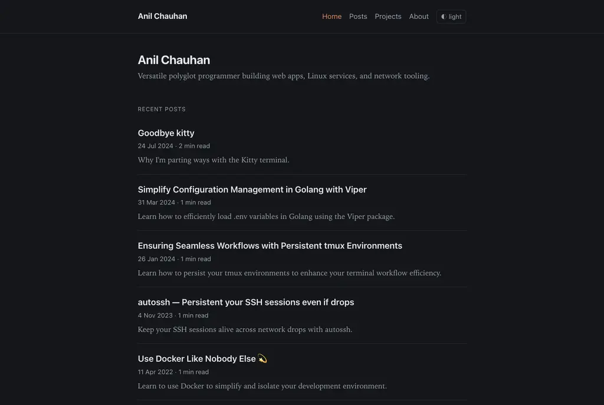
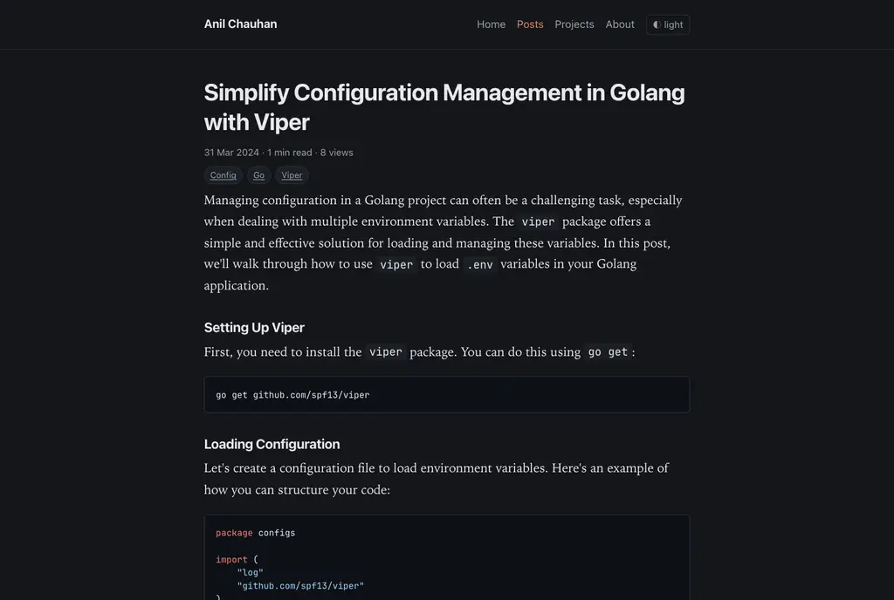
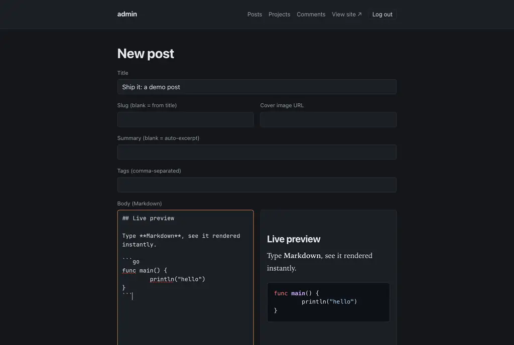

# aniicrite.dev

A small, from-scratch **personal site + blog engine** in Go — server-side
rendered with [templ](https://templ.guide) + [HTMX](https://htmx.org), backed
by SQLite. Single static binary, no static-site generator, no theme, minimal
JavaScript.

[](https://github.com/meanii/aniicrite.dev/actions/workflows/ci.yml)
[](LICENSE)
[](go.mod)

| Home | Post | Admin editor |
|---|---|---|
|  |  |  |

## Features

- **Blog** with Markdown authoring, draft/published states, tags, reading time,
  and server-side code highlighting (goldmark + chroma).
- **Admin panel** — password login, posts & projects CRUD, live Markdown
  preview, image uploads, comment moderation.
- **Comments** via GitHub OAuth (post-immediately with delete/block controls).
- **Full-text search** over posts (SQLite FTS5), live via HTMX.
- **Tag pages**, RSS feed, `sitemap.xml`, JSON-LD, OpenGraph/Twitter cards.
- **Editorial theme**, dark default + light toggle, respects
  `prefers-color-scheme`; theme-aware code blocks.
- **Secure by default** — argon2id admin hash, login rate-limiting, CSP and
  friends, signed/encrypted session cookies.
- **Single binary** — templates and assets embedded; SQLite in one file.

## Tech stack

Go · [templ](https://templ.guide) · [HTMX](https://htmx.org) ·
[chi](https://github.com/go-chi/chi) · [goldmark](https://github.com/yuin/goldmark) +
[chroma](https://github.com/alecthomas/chroma) ·
[modernc SQLite](https://pkg.go.dev/modernc.org/sqlite) (pure Go, no cgo).

## Quickstart

### Local

```sh
go install github.com/a-h/templ/cmd/templ@v0.3.1020   # once
templ generate                                        # after editing .templ files

# generate an admin password hash
go run ./cmd/server hash-password 'your-password'

ADMIN_PASSWORD_HASH='<hash>' \
SESSION_HASH_KEY="$(openssl rand -hex 32)" \
SESSION_BLOCK_KEY="$(openssl rand -hex 32)" \
go run ./cmd/server
# → http://localhost:8080  (admin at /admin/login)
```

### Docker

```sh
docker compose up --build
# → http://localhost:8080  (configure via a local .env — see below)
```

## Configuration

All configuration is via environment variables (a `.env` is read by Docker and
by the systemd unit).

| Variable | Default | Purpose |
|---|---|---|
| `APP_ADDR` | `:8080` | Listen address |
| `APP_ENV` | `dev` | `production` enables `Secure` cookies + HSTS |
| `BASE_URL` | `http://localhost:8080` | Canonical origin (absolute URLs, OAuth callback) |
| `DATA_DIR` | `./data` | SQLite file + uploads + optional `about.md` |
| `ADMIN_PASSWORD_HASH` | — | argon2id hash from `hash-password`; admin disabled if unset |
| `SESSION_HASH_KEY` | random | 32-byte hex (`openssl rand -hex 32`); **set in prod** |
| `SESSION_BLOCK_KEY` | random | 32-byte hex; **set in prod** |
| `GITHUB_CLIENT_ID` / `GITHUB_CLIENT_SECRET` | — | Enable GitHub-OAuth comments |
| `SITE_TITLE` | `My Site` | Site name |
| `SITE_DESC` | `A personal site and blog.` | Meta description fallback |
| `AUTHOR_NAME` | `Your Name` | Displayed author |
| `AUTHOR_BIO` | — | Home/JSON-LD bio |
| `AVATAR_URL` | — | Optional home avatar image URL |
| `OG_IMAGE` | `/static/og-default.png` | Default social-share image |
| `SOCIAL_LINKS` | — | Footer/JSON-LD links: `Label\|URL` pairs, comma-separated |

Example:

```sh
SOCIAL_LINKS="GitHub|https://github.com/you,Mastodon|https://your.instance/@you,Email|mailto:you@example.com"
```

## Content

- **Posts & projects** are managed in the admin panel (`/admin`).
- **About page** — edit the embedded default at `web/content/about.md`, or drop
  an `about.md` into `DATA_DIR` to override it without rebuilding.
- **Import** existing Markdown (front matter + body) with:

  ```sh
  go run ./cmd/server import ./path-to-markdown-dir
  ```

  See `import/` for the front-matter format (`title`, `slug`, `date`, `tags`,
  `status`).

## Deployment

`deploy/` contains a production recipe:

- `Caddyfile` — reverse proxy with automatic TLS + apex/`www` redirects.
- `aniicrite.service` — hardened systemd unit.
- `backup.sh` — consistent SQLite + uploads backup (cron-friendly).
- `.env.example` — the full environment template.

Run the Go binary on `127.0.0.1:8080` behind Caddy, or use the provided
Dockerfile / `compose.yaml`.

## Development

See [CONTRIBUTING.md](CONTRIBUTING.md). Generated `*_templ.go` files are
committed; run `templ generate` after editing `.templ` sources. CI checks
formatting, `go vet`, tests, and that generated files are current.

## License

[MIT](LICENSE) © 2026 Anil Chauhan
